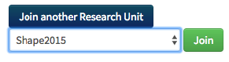
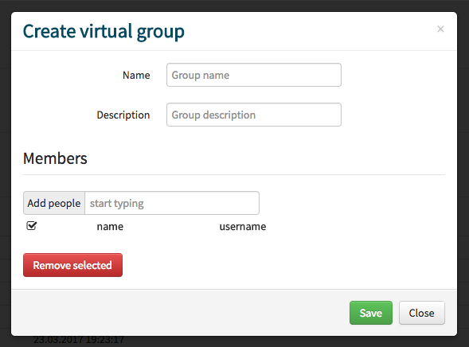
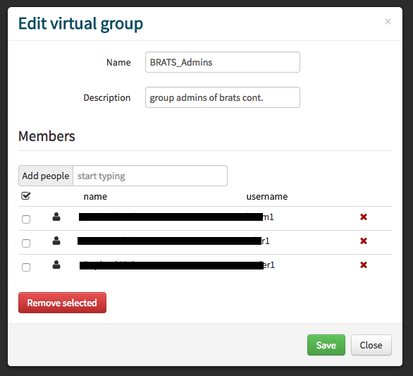
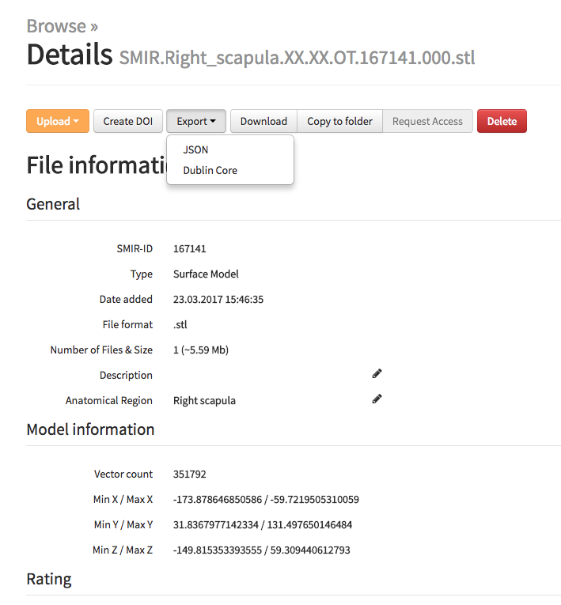
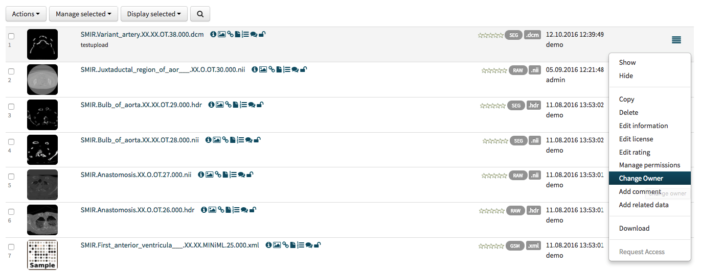
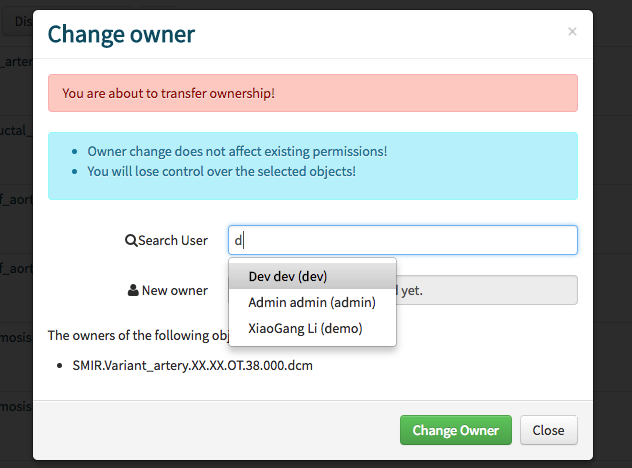
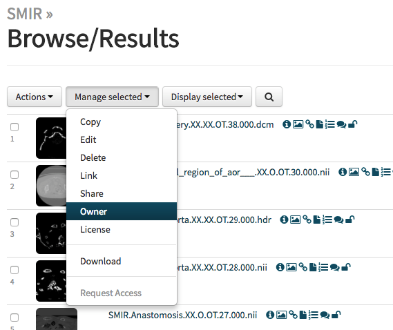
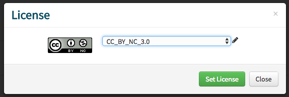
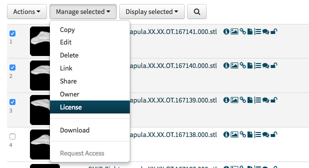
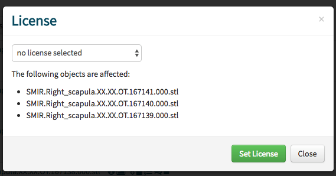

# User Account

## Account Registration

1. Fill the registration form on the [registration page](https://www.smir.ch/Account/Register). Select the appropriate Research Unit. If you need to register a Research Unit, please follow the step in [research unit registration section](#research-unit-registration).
2. Accept the [End User License Agreement](https://www.smir.ch/Home/TermsAndConditions) using the checkbox
3. Complete the Captcha
4. Submit 
5. The Administrator of the Research Unit receive your request and has to process it. This is a manual processes. Please allow up to 7 days for this step. 
6. You will receive an email with your login credentials consisting of the email used for registration and an initial password. Follow the instruction in the [password change section](#password-change) to change the initial password

## Account setup

Go to [MySMIR > Account & Settings](www.smir.ch/MyDB/Profile) to check your profile. Please consider adding a recovery email.

- Title
- Firstname
- Lastname
- Recovery email

## Account deletion

For now, use the [ticket system](https://www.smir.ch/support) to request a deletion: Include the exact same information from your profile in the ticket. 

- Title
- Firstname
- Lastname
- Email
- Recovery email
- Username

## I can't login to my account

### Locked account

Description:    After 5 failed login atemps, your account will be locked for 10 minutes 

Solution:    You can try again after waiting 10 minutes

### Disabled account

Description:  In case of missbehavior or similar reasons, the SMIR team can disable account. 

Solution:  Contact us using our [ticket system](https://www.smir.ch/support)

Description: You have lost your last Research Unit membership

Solution:  Contact us using our [ticket system](https://www.smir.ch/support)

### Invalid credentials

Description: I forgot my password 

Solution:  You can [reset your password](https://www.smir.ch/Account/LostPassword). Read the [password reset section](#password-reset) for instructions.

## Password change

The password can be changed on the [MySMIR > Account & Settings](www.smir.ch/MyDB/Profile) page. See the [password policy section](#password-policy) to create a valid password.

## Password policy

The password has to fullfil these criterias to be valid:

- Length must be between 8 and 12 characters
- It must contain 1 number (0-9)
- It must contain 1 lower case character
- It must contain 1 upper case character
- It must contain 1 special character `( ? } { $ - . , ; : ! ] [ )`

## Password reset

1. Use the [password recovery page](https://www.smir.ch/Account/LostPassword) to reset your lost password.
2. A link to create a new password will be sent to both the registration email and the recovery email. Follow this link to create a new password according to the [password policy](#password-policy)

# Research Unit

Research Units are the organisational units on SMIR. The are administrated by a Research Unit Administratior. Member of a Research Unit have access to a shared group folder. Every user is member of a least one Research Unit and can be members

## Research Unit Administrator

The Research Unit Administrator can

- Accept join request
- Deny join request
- Remove users from a group
- Request be remove from as Research Unit Administrator 

### Accept or reject request

The email informs you that a user requested to be part of a research 
unit/group where you are the research unit administrator. This request 
is pending until you login to your SMIR account and accept/reject the 
user 

1. Login to your VSD account
2. [MySMIR > Group Administration](www.smir.ch/MyDB/GroupAdministration)
3. Accept or reject a user using the respective buttons

### Change Administrator

Please use the [ticket system](https://www.smir.ch/support) to request a Research Unit Administrator change.

## Research Unit Registration

1. Fill the online [registration formular](https://podio.com/webforms/7358442/593063). Make sure to accurately fill the fields, including an accessable website. If you fail to do so your request will not be processed.
2. Wait for the SMIR Admin to check your submission and to setup your Research Unit. This is a manual process and can take up to 7 days.
3. You will receive an email once the Research Unit has been created.
4. Next
   1. If you do not have an account on SMIR, please continue with the description in the [user registration section](#account-registration)
   2. If you already have an account on SMIR, please follow the instruction in the [join a research unit](#join-a-research-unit)

## Join a Research Unit

1. Login
2. Go to [MySMIR > Group Administration: Group Membership](https://www.smir.ch/MyDB/GroupAdministration#groupMembership)
3. In the **Group Management** section klick on the `Join another Research Unit` button and select the Research Unit from the drop-down menu

   

4. Press join to send the join request to the administrator of the Research Unit
5. Allow up to 7 days for the request to be processes by the administrator.

## Request Research Unit deletion

Please use the [ticket system](https://www.smir.ch/support) to request a Research Unit deletion. Only Research Unit Administrators can request deletion of their Research Unit.

## User administration

1. Login
2. Go to [MySMIR > Group Administration: Research Unit Administration](https://www.smir.ch/MyDB/GroupAdministration#researchUnitAdministration) 
   1. You find a list of Research Units you administer and open request
   2. And the list of Research Units members: Click on `History v` 

# Virtual Groups
A user can create and manage Virtual Groups. This can be used to easily apply permission to a custom set of users. User cannot apply to a Virtual Group. Only the creator of the Virtual Group can add and remove users. Hence, Virtual Group are not shown in the list of Research Units (e.g. in the  registration formular)

## Create virtual group

1. Login
2. Go to [MySMIR > Group Administration: Virtual Group Administration](https://www.smir.ch/MyDB/GroupAdministration#virtualGroupAdministration)
3. Click on `Create Group`
4. Fill the 
- Name
- Description
- Members: Search and add users 
5. Save to create the new group
   

## Manage virtual group

1. Login
2. Go to [MySMIR > Group Administration: Virtual Group Administration](https://www.smir.ch/MyDB/GroupAdministration#virtualGroupAdministration)
3. Open the edit modal to manage the Virtual Group by clicking on the menu 
4. Edit 
- Name
- Description
- Search and add users
- Remove users
5. Save to finish

   

# Upload

## Web Upload

Restriction: 2 GB filesize

## API

for large files use the API

# Objects

Data sets are represented as **Objects** on SMIR. Each object has a unique ID, a set of meta data and object permission. The object's ID is static. This allows you to link permanently to an object. Additionaly, SMIR offers to create a [Digital object identifier](https://www.doi.org/) (DOI). Please read the [DOI section](#doi) for details and instructions.

**Link template**

`https://www.smir.ch/Objects/ID`

**Example for ID 101597**

`https://www.smir.ch/Objects/101597`

 

There are different *object types* to represent the type of the data set. Example *object types* are:

- RAW Image like CT scan, MR Images, etc..
- Segementation of Images
- Surface models
- Genetic data

For a complete list check the [technical documentation section](http://smir-docs.readthedocs.io/en/latest/filetypes/).

## Object names

SMIR uses a template to replace filenames after upload. This helps to identify what type of data the object represents by just looking at the name. It also removes identification information stored in the original (local) filename. The original filename is stored but only displayed to the *owner* of the object.

### Naming template

**Template**  `Namespace.Anatomy.Age.Gender.Modality.ID.Filenumber.Extension`

**Example** `SMIR.Right_scapula.56.M.OT.167141.000.stl`

-  Namespace: SMIR
-  Anatomy: Right scapula
-  Age: 56
-  Gender: male
-  Modality: Other Type (OT)
-  ID: 167141
-  Extension: STereoLithography (stl)

## Meta Data

### General meta data

###  Type specific meta data

## Export meta data

MMeta data of an object can be exported on the detail page. Available formats:

- SMIR API (json)

- Dublin core (xml)

  

## DOI

##  Object permissions

### Permission sets

### Default permission

## Owner change

Ech object has exactly one owner. But the owner can change (transfer) the ownership of the object(s).

- Owner change does not affect existing permissions!
- You will lose control over the selected objects!
### Single object

1. Open the Object's menu  

2. Select `Change Owner` 

3. Search the new Owner and confirm the change in the modal to finish the process

   

### Batch change

1. Select multiple object using the checkboxes. 
2. Select `Owner` in the the `Manage selected` drop-down menu

3. Search the new Owner and confirm the change in the modal to finish the process

## License

The license specifies the rights the user has after download whereas object permissions define the access to the file on SMIR.

A license is set for each object. *Copyright* is set as default. Please consider changing it when you prepare the object for publishing. The license file will be included in the download. A list of open source license are available. If you need a custom license please use the [ticket system](https://www.smir.ch/support) to send such a request.

### Change license of a single object

The user can change the license in a object list view or on the object's detail page.

1. Login
2. Navigate to the object
3. Click on the menu icon (list view)
4. Select `Edit license`
5. Select the license from the drop-down menu in the modal 
    
6. `Set license` to change  or `cancel`  to abort

### Batch license change

1. Login
2. Select the object and click on `Manage selected` and then `License`

3. Select the license from the drop-down menu in the modal

4. `Set license` to change/save or `cancel` to abort

##  Preview Images

SMIR generates for Images and model a set of up to 10 preview images to give a glance at the data set. Preview images are not part of the actual data you download.   

## Files

The actual data is not displayed/accessable on SMIR. To use the data set, download the object. However, the list of included files in an object is displayed. 

## Object lists

### Unpublished data

### Published data

## Browse data

# Search

## Search bar

## Advanced search

# Folders